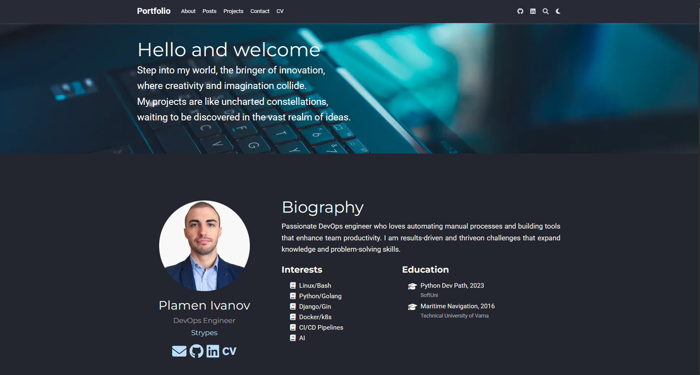

# 🚀 Plamen Ivanov's Portfolio

[](https://k1lgor.github.io)
[](https://github.com/wowchemy/starter-hugo-academic)
[](LICENSE.md)

<div align="center">
  
</div>

## 🌟 Overview

Welcome to my personal portfolio website built with [Hugo](https://gohugo.io/) and the [Academic Theme](https://github.com/wowchemy/starter-hugo-academic). This site showcases my skills, projects, experience, and certifications as a DevOps Engineer.

> Step into my world, the bringer of innovation,
> where creativity and imagination collide.
> My projects are like uncharted constellations,
> waiting to be discovered in the vast realm of ideas.

## 💻 Tech Stack

This portfolio is powered by:

- **[Hugo](https://gohugo.io/)** - The world's fastest framework for building websites
- **[Wowchemy Academic Theme](https://github.com/wowchemy/starter-hugo-academic)** - The website builder for Hugo
- **[GitHub Pages](https://pages.github.com/)** - Hosting platform

## 🔧 My Skills

### Operating Systems

- Arch Linux
- RHEL
- OpenSUSE
- Debian

### Development Tools

- VSCode
- Sublime Text
- Trae
- Windsurf IDE

### Version Control & Project Management

- Git
- ClearCase
- GitHub
- BitBucket
- Jira
- Confluence

### Virtualization

- VMware Workstation
- VirtualBox
- Vagrant

### Programming Languages

- Bash
- Python
- Golang
- JavaScript
- Markdown

### Frontend

- Vue.js
- Bootstrap
- HTML
- CSS

### Backend

- Django
- Django Rest Framework
- Gin

### CI/CD & Containers

- Docker
- Podman
- Jenkins
- GitHub Actions
- Kubernetes

## 🚀 Getting Started

### Prerequisites

- [Hugo Extended](https://gohugo.io/getting-started/installing/) (v0.80.0 or higher)
- [Git](https://git-scm.com/)
- [Go](https://golang.org/) (for Hugo modules)

### Installation

1. Clone this repository:

   ```bash
   git clone https://github.com/k1lgor/hugo-portfolio.git
   cd hugo-portfolio
   ```

2. Start the development server:

   ```bash
   hugo server
   ```

3. View your site at <http://localhost:1313/>

### Deployment

This site is configured to deploy to GitHub Pages. Push changes to the main branch to trigger a deployment:

```bash
git add .
git commit -m "Update portfolio"
git push origin main
```

## 📝 Customization

To customize this portfolio:

1. Edit the configuration files in the `config/_default/` directory
2. Modify content in the `content/` directory
3. Add your own assets to the `assets/` directory
4. Create or update widgets in the `content/_index.md` file

## 📄 License

This project is licensed under the MIT License - see the [LICENSE.md](LICENSE.md) file for details.

## 📞 Contact

- GitHub: [@k1lgor](https://github.com/k1lgor)
- LinkedIn: [Plamen Ivanov](https://www.linkedin.com/in/plamen-i-ivanov/)
- Website: [k1lgor.github.io/hugo-portfolio](https://k1lgor.github.io/hugo-portfolio)

---

<div align="center">
  <p>Built with ❤️ by Plamen Ivanov</p>
  <p>Powered by <a href="https://github.com/wowchemy/starter-hugo-academic">Hugo Academic Theme</a></p>
</div>
